# Active Response – Automated SSH Brute Force Mitigation

## Objective

Configure Wazuh Active Response to automatically block attacker IP addresses after detecting SSH brute-force login attempts.

---

## Lab Environment

| Component             | Purpose                |
| --------------------- | ---------------------- |
| Wazuh Manager         | Detection and Response |
| Ubuntu Agent          | Target System          |
| Kali Linux            | Attacker Machine       |
| Wazuh Active Response | Automated Blocking     |
| IPTables              | Firewall Enforcement   |

---

## Detection and Response Flow

```text
Hydra SSH Attack
        ↓
Ubuntu SSH Logs
        ↓
Wazuh Agent
        ↓
Wazuh Manager
        ↓
Rule 5710 Triggered
        ↓
firewall-drop Executed
        ↓
IPTables Rule Added
        ↓
Attacker IP Blocked
```

---

# Step 1: Backup Wazuh Configuration

Before modifying Active Response settings, a backup of the Wazuh configuration file was created.

```bash
sudo cp /var/ossec/etc/ossec.conf \
/var/ossec/etc/ossec.conf.active-response.bak
```

### Evidence

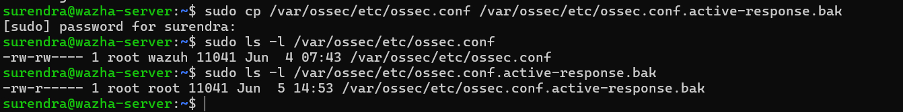

---

# Step 2: Verify Active Response Section

Verified that the Active Response section exists in the Wazuh configuration.

```bash
sudo grep -n "<active-response>" /var/ossec/etc/ossec.conf
```

### Evidence

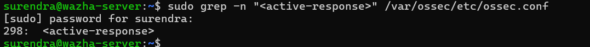

---

# Step 3: Verify Available Active Response Scripts

Reviewed the available scripts that can be executed automatically by Wazuh.

```bash
sudo ls -l /var/ossec/active-response/bin/
```

Important scripts identified:

* firewall-drop
* host-deny
* disable-account
* firewalld-drop

### Evidence

.png)

---

# Step 4: Verify Firewall Environment

Verified the firewall technology available on the Wazuh server.

```bash
sudo iptables -L -n
sudo firewall-cmd --state
```

Result:

* IPTables available
* firewalld not installed

Based on this verification, the firewall-drop script was selected.

### Evidence

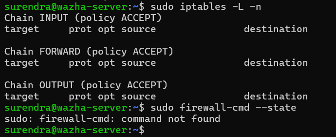

---

# Step 5: Configure Active Response

Configured Wazuh to execute firewall-drop whenever Rule ID 5710 is triggered.

Configuration added to:

```text
/var/ossec/etc/ossec.conf
```

```xml
<active-response>
  <command>firewall-drop</command>
  <location>local</location>
  <rules_id>5710</rules_id>
  <timeout>600</timeout>
</active-response>
```

Configuration Details:

| Parameter     | Description                    |
| ------------- | ------------------------------ |
| firewall-drop | Blocks attacker IP             |
| local         | Executes on monitored host     |
| rules_id 5710 | SSH brute-force detection rule |
| timeout 600   | Block duration of 10 minutes   |

### Evidence

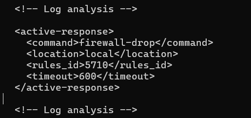

---

# Step 6: Validate Configuration

Validated the updated configuration before restarting Wazuh.

```bash
sudo /var/ossec/bin/wazuh-analysisd -t
```

Result:

```text
No errors returned
```

### Evidence

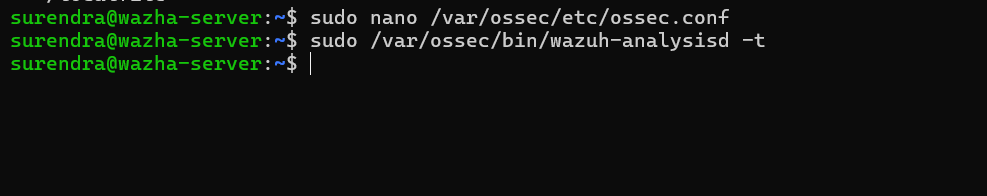

---

# Step 7: Restart Wazuh Manager

Applied configuration changes.

```bash
sudo systemctl restart wazuh-manager
sudo systemctl status wazuh-manager
```

Result:

```text
Active: active (running)
```

### Evidence

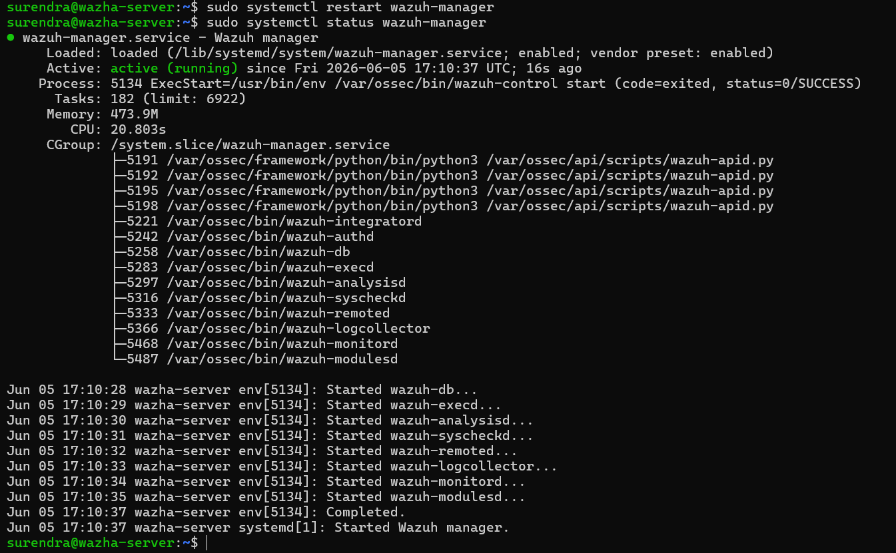

---

# Step 8: Verify SSH Detection Rule

Verified Rule ID 5710 used for SSH authentication failure detection.

```bash
sudo grep -R "5710" /var/ossec/ruleset/rules/
```

Result:

```text
Rule ID: 5710
Description:
Attempt to login using a non-existent user
```

### Evidence

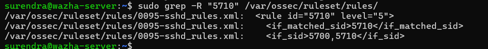

---

# Step 9: Simulate SSH Brute Force Attack

Created a password list and executed Hydra from Kali Linux.

```bash
hydra -l invaliduser -P passwords.txt ssh://192.168.163.133 -V
```

Purpose:

* Generate failed SSH logins
* Trigger Wazuh detection
* Trigger Active Response

### Evidence

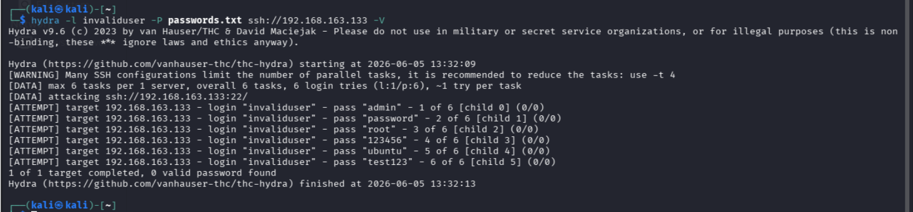

---

# Step 10: Detect Authentication Failures

Wazuh successfully detected multiple failed SSH login attempts.

Rule Triggered:

```text
Rule ID: 5710
sshd: Attempt to login using a non-existent user
```

### Evidence

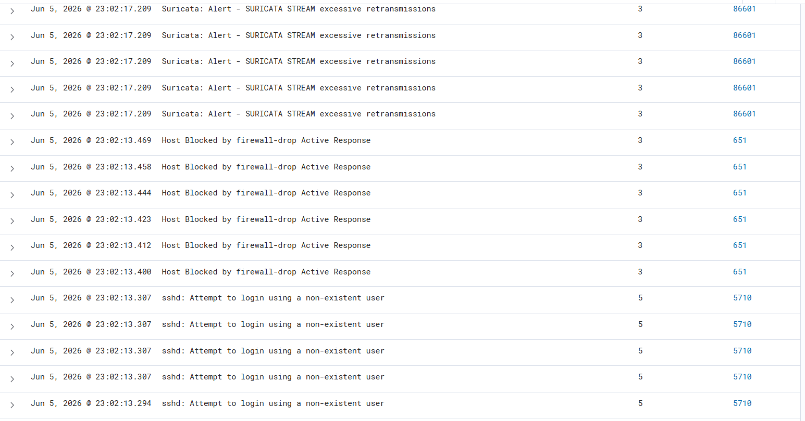

---

# Step 11: Verify Network Block

After Active Response execution, Nmap was used to verify connectivity.

```bash
nmap -Pn -p 22 192.168.163.133
```

Result:

```text
22/tcp filtered ssh
```

This confirmed that the attacker system could no longer reach the SSH service.

### Evidence

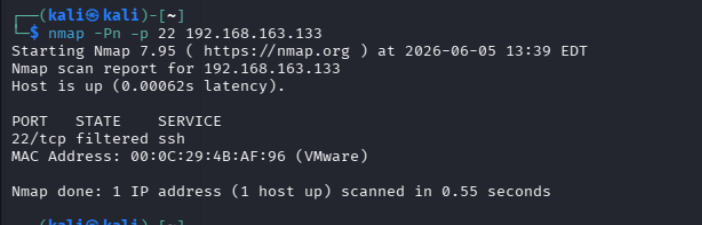

---

# Step 12: Verify IPTables Block Rule

Verified that Wazuh automatically inserted a DROP rule.

```bash
sudo iptables -L -n
```

Result:

```text
DROP all -- 192.168.163.129 0.0.0.0/0
```

This confirmed successful execution of the firewall-drop script.

### Evidence

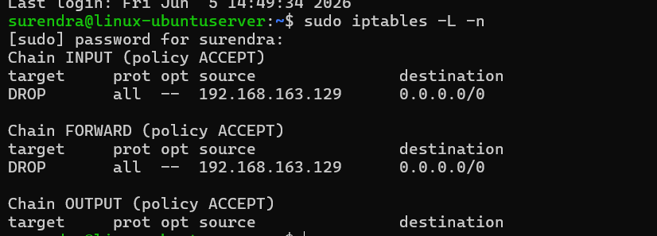

---

# Outcome

Successfully implemented and validated Wazuh Active Response for SSH brute-force mitigation.

Capabilities demonstrated:

* SSH Brute Force Detection
* Automated Incident Response
* Dynamic IP Blocking
* IPTables Integration
* Attack Containment
* Security Event Correlation
* Detection-to-Response Workflow

---

# Skills Demonstrated

* Wazuh SIEM Administration
* Active Response Configuration
* SSH Security Monitoring
* Hydra Attack Simulation
* IPTables Management
* Linux Administration
* Incident Response
* Security Operations (SOC)
