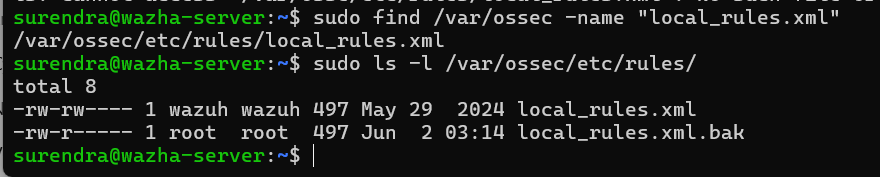
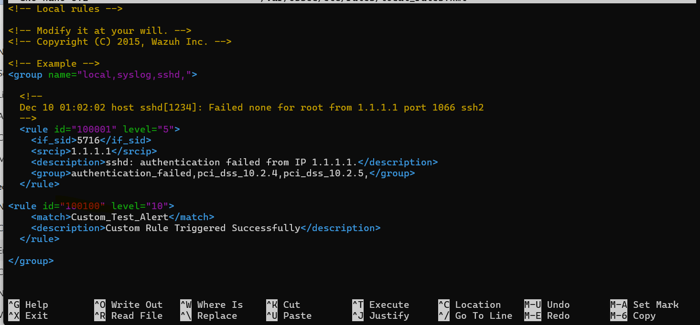
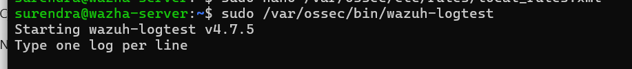
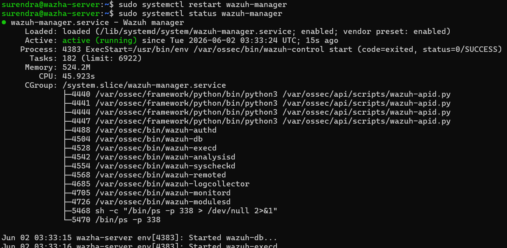
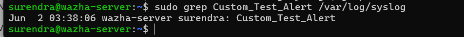
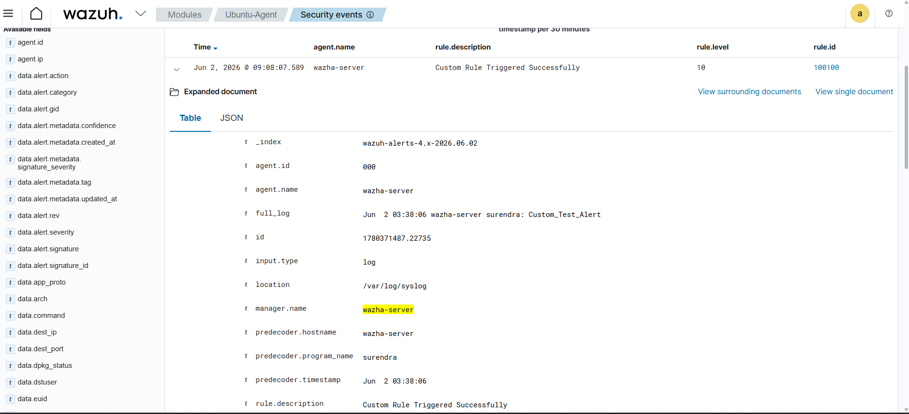

# Custom Rules Validation

## Objective

Create and validate a custom Wazuh rule that generates an alert when a specific log entry is detected.

---

## Rule File Backup

Before making changes, a backup of the existing rule file was created.

```bash
sudo cp /var/ossec/etc/rules/local_rules.xml \
/var/ossec/etc/rules/local_rules.xml.bak
```

### Screenshot



---

## Custom Rule Creation

The following custom rule was added to `local_rules.xml`.

```xml
<rule id="100100" level="10">
  <match>Custom_Test_Alert</match>
  <description>Custom Rule Triggered Successfully</description>
</rule>
```

### Screenshot



---

## Rule Syntax Validation

The rule syntax was verified using Wazuh Logtest.

```bash
sudo /var/ossec/bin/wazuh-logtest
```

### Screenshot



---

## Wazuh Manager Restart

The Wazuh Manager service was restarted to load the newly added rule.

```bash
sudo systemctl restart wazuh-manager
sudo systemctl status wazuh-manager
```

### Screenshot



---

## Test Log Generation

A test log entry was generated using the Linux logger utility.

```bash
logger "Custom_Test_Alert"
```

The log was verified in syslog.

```bash
sudo grep Custom_Test_Alert /var/log/syslog
```

### Screenshot



---

## Alert Verification

The custom rule successfully generated an alert in the Wazuh Dashboard.

Alert Details:

- Rule ID: 100100
- Rule Level: 10
- Description: Custom Rule Triggered Successfully

### Screenshot



---

## Result

Successfully created, validated, and tested a custom Wazuh rule. The rule detected the custom log event and generated an alert in the Wazuh Dashboard.