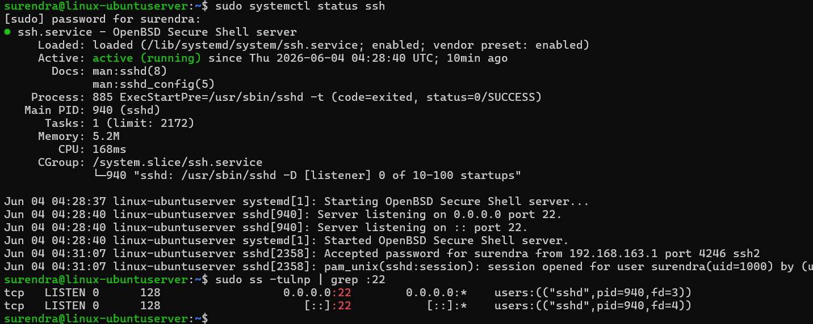
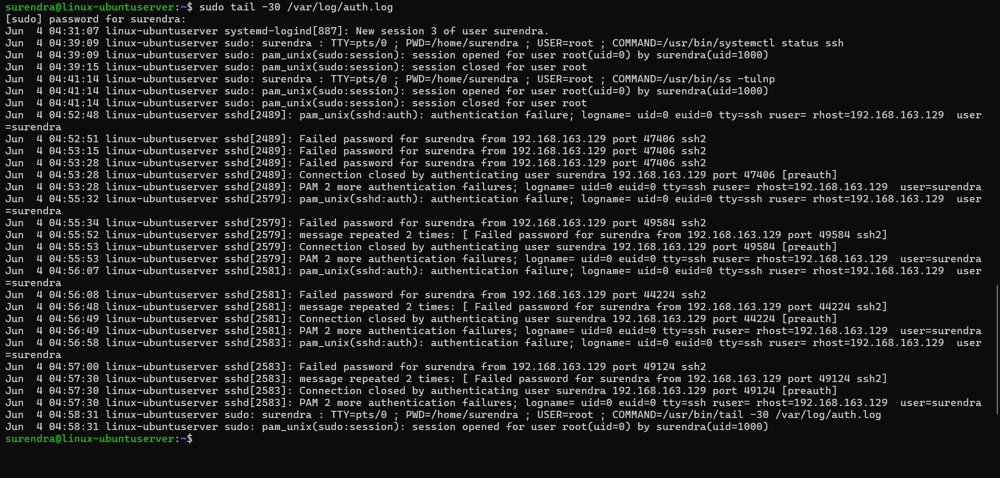
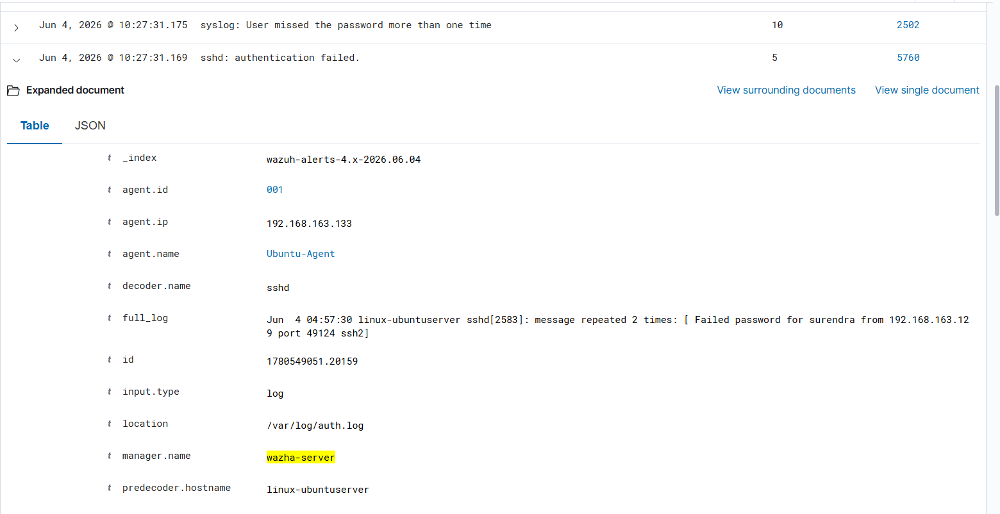
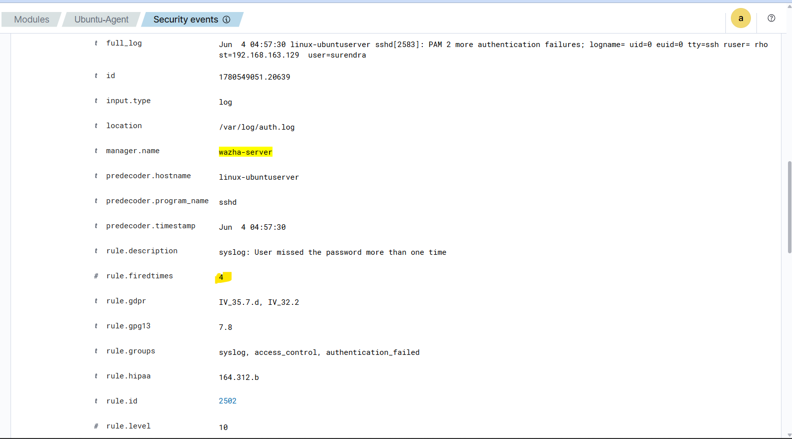

# SSH Brute Force Detection

## Objective

The objective of this lab is to simulate SSH brute force login attempts from a Kali Linux machine against an Ubuntu Agent and verify that Wazuh detects both individual authentication failures and brute force activity through correlation rules.

---

## Lab Environment

| Component     | IP Address      |
| ------------- | --------------- |
| Wazuh Manager | 192.168.163.130 |
| Ubuntu Agent  | 192.168.163.133 |
| Kali Linux    | 192.168.163.129 |

---

## 1. SSH Service Verification

Verified that the SSH service was running and listening on port 22 on the Ubuntu Agent.

Commands Used:

```bash
sudo systemctl status ssh
sudo ss -tulnp | grep :22
```

### Evidence


### Pre_Installation_Check




---

## 2. Failed Login Simulation

Multiple SSH login attempts were performed from the Kali Linux machine using incorrect passwords.

Command Used:

```bash
ssh surendra@192.168.163.133
```

The incorrect password was entered multiple times to simulate brute force authentication attempts.

### Evidence

#### Failed_Login_Attempts



---

## 3. SSH Authentication Failure Detection

The failed login attempts generated authentication failure logs in the Ubuntu Agent.

The Wazuh Agent collected these logs from:

```text
/var/log/auth.log
```

and forwarded them to the Wazuh Manager.

Wazuh generated an alert for each failed authentication attempt.

Observed Rule:

* Rule ID: 5760
* Description: sshd: authentication failed

### Evidence

#### SSH_Failed_Login_Detected_In_Wazuh



---

## 4. SSH Brute Force Correlation Detection

After multiple failed authentication attempts from the same source IP address, Wazuh correlation rules generated a higher-severity alert indicating possible brute force activity.

Observed Rule:

* Rule ID: 2502
* Rule Level: 10
* Description: User missed the password more than one time

This confirms that Wazuh successfully correlated multiple authentication failures and identified suspicious login activity.

### Evidence

#### SSH_Bruteforce_Correlation_Detected



---

## Detection Flow

```text
Kali Linux
      ↓
Multiple Failed SSH Login Attempts
      ↓
Ubuntu SSH Service (sshd)
      ↓
/var/log/auth.log
      ↓
Wazuh Agent (001)
      ↓
Wazuh Manager
      ↓
Rule 5760
(SSH Authentication Failure)
      ↓
Rule 2502
(Brute Force Correlation)
      ↓
Wazuh Dashboard Alert
```

---

## Result

Successfully simulated SSH brute force login attempts from Kali Linux against the Ubuntu Agent.

Verified:

* SSH service availability
* Failed login generation
* Authentication failure detection
* Log forwarding through Wazuh Agent
* Alert generation by Wazuh Manager
* Brute force correlation detection using Wazuh rules

The SSH Brute Force Detection use case was successfully validated in the Wazuh SIEM environment.
