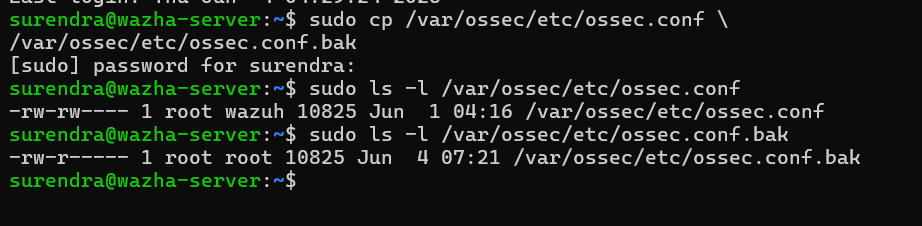
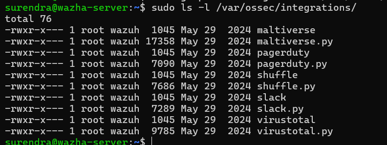
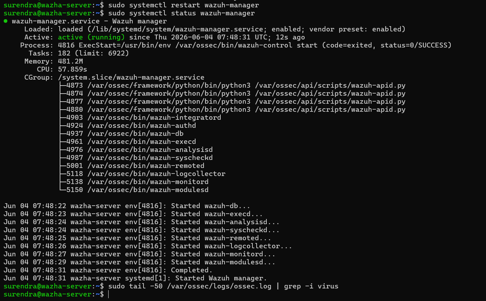
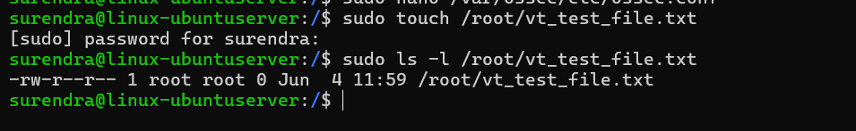
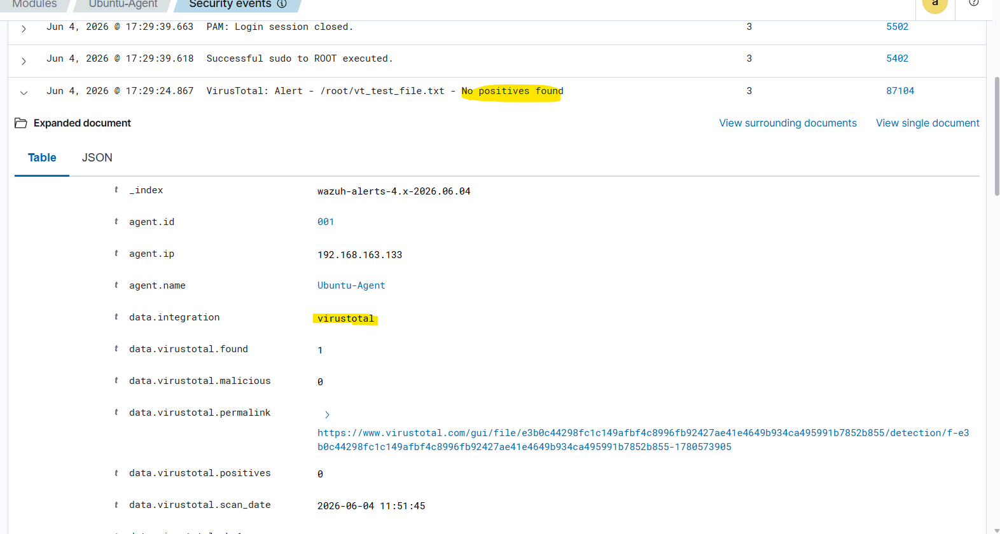
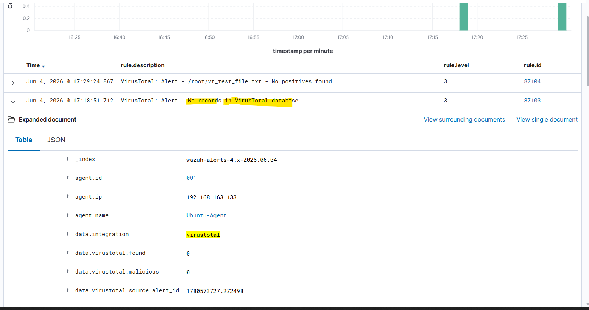
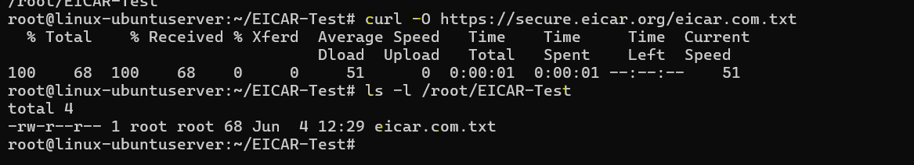
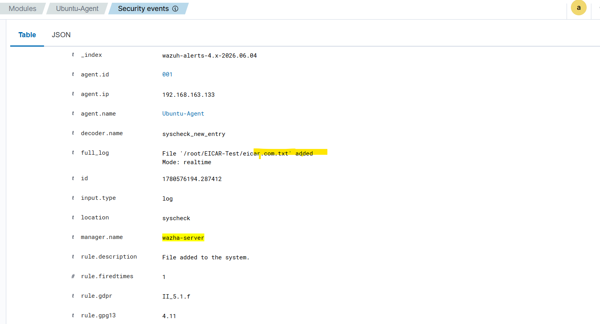
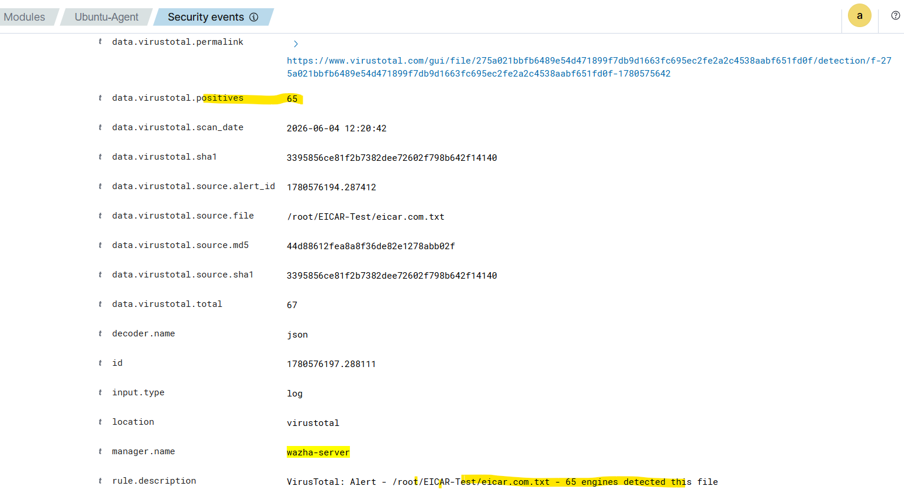
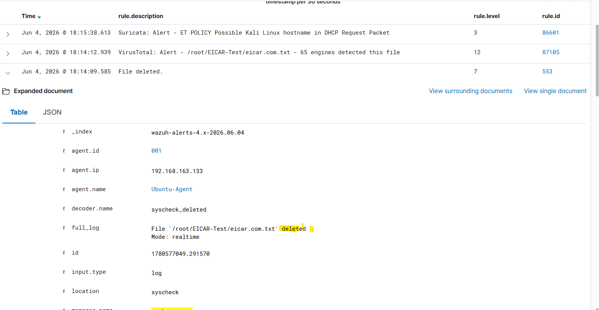

# VirusTotal Integration with Wazuh

## Objective

Integrate VirusTotal Threat Intelligence with Wazuh SIEM to automatically analyze file hashes detected through File Integrity Monitoring (FIM) and identify malicious files.

---

## Lab Environment

| Component | Details |
|------------|-----------|
| SIEM | Wazuh v4.7.5 |
| Wazuh Manager | Ubuntu Server |
| Agent | Ubuntu Endpoint |
| Threat Intelligence | VirusTotal API |
| Monitoring | File Integrity Monitoring (FIM) |
| Test Malware | EICAR Test File |

---

## Detection Flow

File Created/Modified
↓
Wazuh FIM Detection
↓
Hash Calculation (MD5/SHA1)
↓
VirusTotal API Lookup
↓
Threat Intelligence Analysis
↓
Malicious/Benign Verdict
↓
Alert Generated in Wazuh Dashboard

---

## 1. Backup Existing Configuration

Created backup of Wazuh configuration file before modifications.

### Evidence



---

## 2. Configure VirusTotal Integration

Added VirusTotal API integration in:

```xml
/var/ossec/etc/ossec.conf
```

```xml
<integration>
  <name>virustotal</name>
  <api_key>YOUR_API_KEY</api_key>
  <group>syscheck</group>
  <alert_format>json</alert_format>
</integration>
```

### Evidence



---

## 3. Restart Wazuh Manager

Validated configuration and restarted Wazuh services.

### Evidence



---

## 4. File Integrity Monitoring Test

Created a test file in monitored directory.

Command:

```bash
sudo touch /root/vt_test_file.txt
```

### Evidence



---

## 5. FIM Alert Detection

Wazuh detected file creation successfully.

### Evidence



---

## 6. VirusTotal Lookup Result

VirusTotal checked the file hash and returned a clean verdict.

Result:

```text
No positives found
```

### Evidence



---

## 7. Malware Simulation using EICAR

Downloaded EICAR test malware file.

Command:

```bash
curl -O https://secure.eicar.org/eicar.com.txt
```

### Evidence



---

## 8. EICAR File Detected by FIM

Wazuh detected file creation in real time.

### Evidence



---

## 9. VirusTotal Malware Detection

VirusTotal identified the EICAR file as malicious.

Detection Result:

```text
65 / 67 Security Engines Detected Malware
```

### Evidence



---

## 10. File Deletion Detection

Deleted EICAR file and verified FIM alert generation.

Command:

```bash
rm eicar.com.txt
```

### Evidence



---

## Outcome

Successfully integrated VirusTotal Threat Intelligence with Wazuh SIEM.

Capabilities demonstrated:

- File Integrity Monitoring (FIM)
- Real-Time File Monitoring
- Hash-Based Reputation Analysis
- Threat Intelligence Integration
- Malware Detection
- Security Event Correlation
- Incident Investigation Workflow

---

## Skills Demonstrated

- Wazuh SIEM Administration
- Threat Intelligence Integration
- VirusTotal API Configuration
- File Integrity Monitoring (FIM)
- Linux Administration
- Malware Detection
- Security Monitoring
- Incident Analysis
