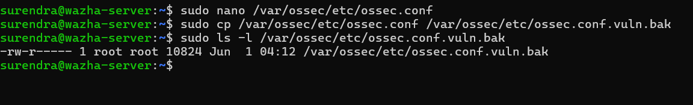
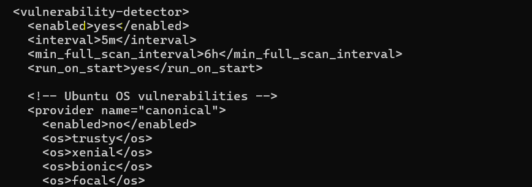
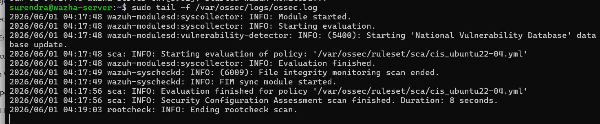
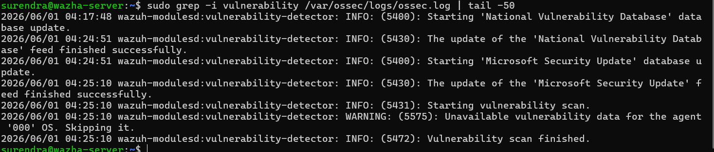

# Vulnerability Detection using Wazuh

## Objective

Enable and validate the Wazuh Vulnerability Detection module for the Ubuntu Agent.

## Steps Performed

### 1. Backup Configuration

```bash
sudo cp /var/ossec/etc/ossec.conf /var/ossec/etc/ossec.conf.bak
```

### 2. Enable Vulnerability Detection

Edited:

```bash
sudo nano /var/ossec/etc/ossec.conf
```

Updated:

```xml
<vulnerability-detection>
  <enabled>yes</enabled>
</vulnerability-detection>
```

### 3. Restart Wazuh Manager

```bash
sudo systemctl restart wazuh-manager
```

### 4. Verify Module Status

```bash
sudo grep -i vulnerability /var/ossec/logs/ossec.log | tail -50
```

Verified:

* Vulnerability module started
* Vulnerability feed updated successfully
* Vulnerability scan started
* Vulnerability scan completed

### 5. Verify Ubuntu Agent

```bash
sudo /var/ossec/bin/agent_control -i 001
```

Result:

* Ubuntu Agent connected and active

### 6. Verify Syscollector

```bash
sudo grep -i syscollector /var/ossec/logs/ossec.log | tail -50
```

Result:

* Syscollector running successfully
* Software inventory collected from Ubuntu Agent

### 7. Verify Package Inventory

```bash
sudo sqlite3 /var/ossec/queue/db/001.db "SELECT COUNT(*) FROM sys_programs;"
```

Result:

```text
732
```

Software packages were successfully collected.

## Result

* Vulnerability Detection module enabled successfully.
* Vulnerability feeds downloaded successfully.
* Vulnerability scans executed successfully.
* Ubuntu Agent inventory collected successfully.
* No CVE entries were generated during testing.

## Screenshots

### 01_Vulnerability_Config_Backup


### 02_Vulnerability_Config_Updated


### 03_Wazuh_Manager_Restart


### 04_Vulnerability_Module_Started


### 05_Vulnerability_Scan_Completed


## Conclusion

Wazuh Vulnerability Detection was configured and validated successfully. The module, feed updates, scans, and software inventory collection were verified in the lab environment.
